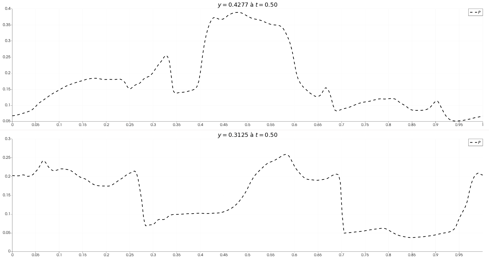

# Vortex de Orszag-Tang

**Description**  
Ce problème a été introduit par Orszag et Tang en 1979, et utilisé fréquemment pour comparer des simulations MHD.

**Caractéristiques**  
Pour ce test nous utilisons un domaine carré, en prenant $0 \leq x \leq 1$ et $0 \leq y \leq 1$ et des conditions périodiques sur les quatres bords. Les conditions initiales pour la densité $\rho=\dfrac{5\gamma}{12\pi} = \dfrac{25}{36\pi}$ et la pression $P=\dfrac{\gamma}{4\pi} = \dfrac{5}{12\pi}$, en utilisant donc $\gamma=5/3$. Les vitesses initiales sont périodiques, avec $v_x = -\sin(2\pi y)$ et $v_y = -\sin(2\pi x)$. Le champ magnétique initial est lui initialisé en utilisant un vecteur potentiel $A_z = B_0 \left(\dfrac{cos(4\pi x)}{4\pi} + \dfrac{cos(2\pi y)}{2\pi} \right)$ ce qui donne $B_x = -B_0 \sin(2\pi y)$ et $B_y = B_0 \sin(4\pi x)$, avec $B_0=1/\sqrt{4\pi}$.

**Pertinence**  
Ce problème est connu pour tester les transitions vers les turbulences supersoniques en MHD 2D. Notamment, ce problème est utilisé pour vérifier la capacité du code à gérer la formation des chocs MHD et, des intéractions choc-choc. Il permet également de donner des estimations quantitatives sur l'impact des monopoles magnétiques sur la solution, donc de tester la condition $\nabla \cdot B = 0$.

**Résultats**  
La simulation a été réalisée sur une grille de $512 \times 512$, avec une $CFL=0.1$ et un solveur *HLLD* combiné à un nettoyage de divergence hyperbolique.

<https://github.com/user-attachments/assets/e611f5ae-de82-41ce-a5d2-801565064a94>

Afin de tester quantitativement nos résultats, on trace deux tranches de notre domaine à $y=0.4277$ et $y=0.3125$ que l'on compare à la figure 11 de Londrillo et Del Zanna (2000)

Notre résultat semble quantitavement correct et qualitativement proche, mais l'on remarque que notre solveur est davantage diffusif que celui d'Athena. Ceci est notamment dû à l'ordre auquel nous résolvons (2 pour nous, 3 pour Athena).

Nous avons réalisé d'autres simulations afin de tester nos solveurs :

- Solveur dit "Cinq Ondes", avec une grille de $512\times512$, une $CFL=0.1$ et sans nettoyage de la divergence (divergence cleaning).

<https://github.com/user-attachments/assets/5b1ec3e7-21f0-4b14-b717-dfa7ae0d8431>

- Solveur Cinq Ondes, avec la même grille et $CFL=0.1$, avec nettoyage hyperbolique de la divergence

<https://github.com/user-attachments/assets/4cff577b-32dd-4bba-b4e1-751cf87c57eb>

TODO:
Ajouter une analyse des résulats davantage qualitative :

1. Tracé du divB
2. Tracé comparatif des tranches du domaine

**Références**  

- Test du [vortex Orszag-Tang Athena](https://www.astro.princeton.edu/~jstone/Athena/tests/orszag-tang/pagesource.html)
- [Orszag, S.A., Tang, C.-M., 1979. Small-scale structure of two-dimensional magnetohydrodynamic turbulence. Journal of Fluid Mechanics 90, 129–143.](https://doi.org/10.1017/S002211207900210X)
- [Londrillo, P., Zanna, L.D., 2000. High-Order Upwind Schemes forMultidimensional Magnetohydrodynamics. ApJ 530, 508.](https://doi.org/10.1086/308344)
