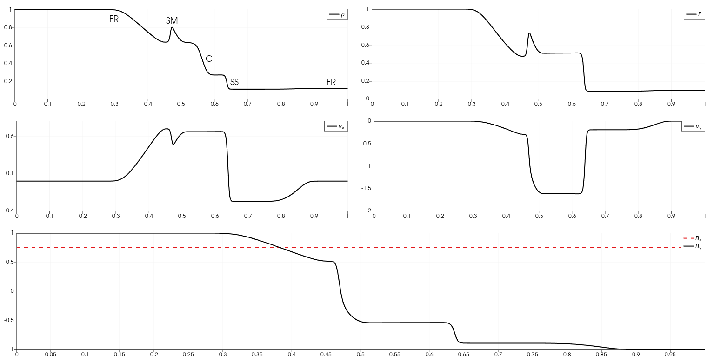

# Tube à choc de Sod magnétique

**Description**  
Ce test est l'équivalent MHD d'un tube à choc, où les états gauche et droit sont initalisés avec des valeurs différentes, séparés par une interface positionnée au milieu du domaine. Bien que nous devons le test à Brio et Wu, nous le surnommons *Sod magnétique* car les quantités hydrondynamiques initiales sont les mêmes que celles du problème de tube à choc de Sod. 

**Pertinence**  
L'importance de ce test, qui est un standard pour les codes MHD, réside dans sa capacité à tester si le code permet de représenter précisement les ondes de choc, de raréfaction, les discontinuités de contact, ainsi que les structures composées de la MHD.

**Caractéristiques**  
Les états initiaux sont les suivants :

$$
\bold{Q_L} =
\begin{pmatrix}
\rho \\
v_x \\
v_y\\
v_z\\
B_x\\
B_y\\
B_z\\
p \\
\end{pmatrix} = 
\begin{pmatrix}
1\\
0 \\
0 \\
0\\
0.75\\
1\\
0\\
1\\
\end{pmatrix}
\text{ et }

\bold{Q_R} =
\begin{pmatrix}
\rho \\
v_x \\
v_y\\
v_z\\
B_x\\
B_y\\
B_z\\
p \\
\end{pmatrix} = 
\begin{pmatrix}
0.125\\
0 \\
0 \\
0\\
0.75\\
-1\\
0\\
0.1\\
\end{pmatrix}
$$

où $\{\bold{L}, \bold{R}\}$ désignent respectivement les états gauche et droit. Nous prenons $\gamma = 5/3$.

**Résultats**  

On constate sur la figure qu'on retrouve parmi les ondes se déplaçant vers la gauche ; une onde de raréfaction *rapide* (indiquée $FR$) et une onde composée lente, $SM$. Parmi les ondes se déplaçant vers la droite on observe une discontinuité de contact $C$, une onde de choc lente $SS$ et, une onde de raréfaction rapide $FR$. 

**Référence**
Le test a été effectué en se basant sur [la page Brio et Wu](https://www.astro.princeton.edu/~jstone/Athena/tests/brio-wu/Brio-Wu.html) du code Athena, qui fait référence à l'article originel de Brio et Wu : [Brio, M. & C.C. Wu, "An Upwind Differencing Scheme for the Equations of Ideal Magnetohydrodynamics", Journal of Computational Physics, 75, 400-422 (1988)](https://ui.adsabs.harvard.edu/abs/1988JCoPh..75..400B/abstract)
